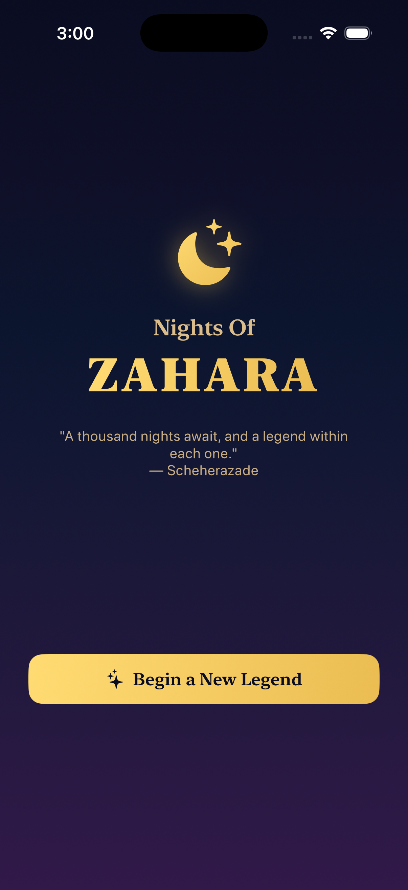
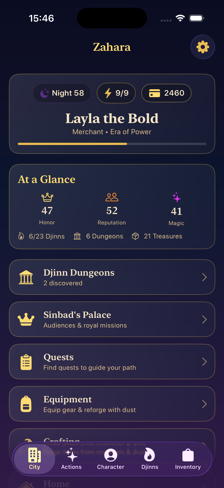
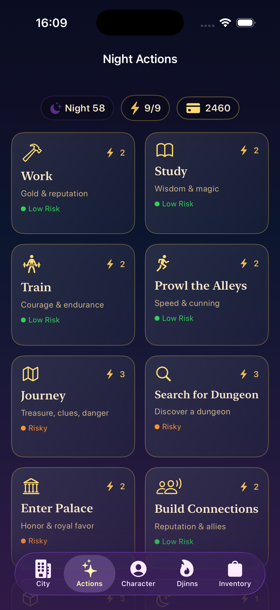
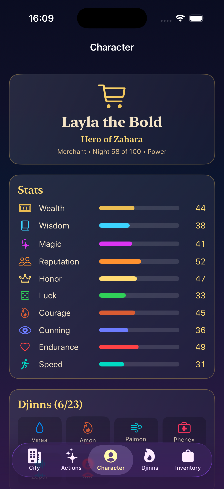
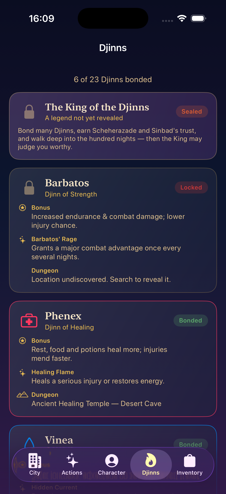
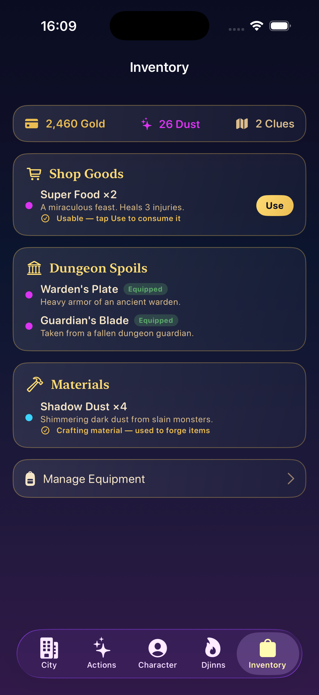
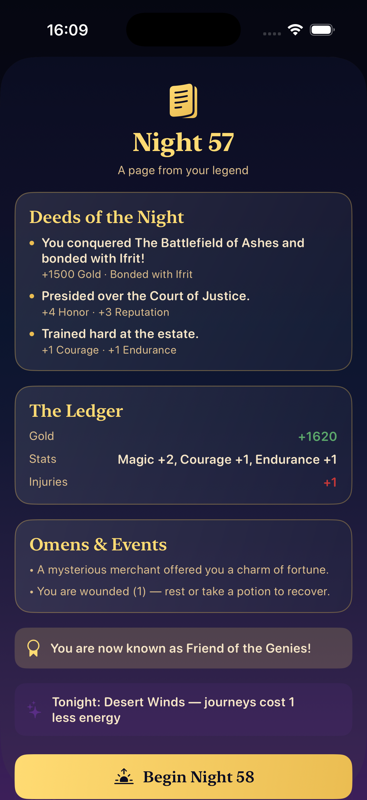

<div align="center">


# Nights Of Zahara

**A life-simulation / light RPG for iPhone, inspired by *One Thousand and One Nights*.**

Built with **SwiftUI** · **MVVM** · Local save · iOS 26

Video Demonstraion is in the project files.

</div>

---

## ✨ Overview

You arrive in **Zahara**, a magical desert city of markets, storytellers, sailors and palace intrigue. Guided by the sorceress **Scheherazade** and ruled by the legendary sailor-king **Sinbad**, you live out your legend one night at a time. Every night you spend a limited pool of energy on actions that shape your stats, wealth, reputation and fate.

The game is **100 playable nights** — told in the spirit of the thousand nights. When you reach the hundredth night you're shown a **grand retrospective of your whole journey** and given a choice: **continue** onward (your legend keeps going, with another checkpoint every 100 nights) or **finish** and read the final legend of the life you built.

Your goal: brave journeys, uncover hidden **Djinn dungeons**, conquer them to bond with the **22 Djinns of Zahara** (and, if you prove worthy, the legendary **King of the Djinns**), win the favor of the city's great figures, complete King Sinbad's royal missions, and earn a final title based on everything you did.

<div align="center">

</div>

---

## 📸 Screenshots

|            City of Zahara            |             Night Actions             |             Character Sheet              |
| :----------------------------------: | :-----------------------------------: | :--------------------------------------: |
|  |  |  |
|          **Djinn Collection**          |             **Inventory**             |             **Night Summary**             |
|  |  |  |

---

## 📖 How to Play

New to Zahara? Here's what each screen and action is for.

### The five screens (bottom tabs)

| Screen | What it's for |
|--------|---------------|
| 🏙️ **City** | Your hub. Shows the HUD (night, energy, gold), an *At a Glance* summary of your stats and progress, and doorways to **Sinbad's Palace**, the **Djinn Dungeons**, **Quests**, **Equipment**, **Crafting** and your **Home** — plus *The Chronicle*, a log of your recent nights. |
| ✨ **Actions** | Where you spend the night. Pick an action card to raise stats, earn gold, explore or rest. Each card shows its **energy cost** and **risk**; tapping one opens a preview with the odds before you commit. When your energy runs out, **End Night** to advance. |
| 👤 **Character** | Your full sheet: all **10 stats** with bars, your role, current night and era, active **title**, injuries/fatigue, and your bonded **Djinns**. This is where you read who your character has become. |
| 🔥 **Djinns** | The collection of all **22 Djinns + the King** (23 in total). Each card shows the Djinn's bonus, signature ability and its dungeon — sealed, discovered or bonded. Track how close you are to a full set. |
| 🎒 **Inventory** | Everything you carry: shop goods, dungeon spoils, crafting materials, magical dust and dungeon clues. Use consumables, and open **Manage Equipment** to equip gear and artifacts. |

Reached from the **City** screen: **Sinbad's Palace** (royal missions & the Court of Justice), your **Home** (build rooms for passive bonuses), the **Crafting** bench, the **Quest log**, **Companions**, the **Codex** (lore) and **Settings**.

### The night actions

Every night you have a pool of **energy**. Actions cost energy (or gold), and riskier ones can wound you — but they pay the most.

| Action | Energy | Risk | What it does |
|--------|:------:|------|--------------|
| 🔨 **Work** | 2 | Low | Labor in the bazaar for **gold and reputation**. |
| 📖 **Study** | 2 | Low | Pore over scrolls to raise **Wisdom and Magic**. |
| 🏋️ **Train** | 2 | Low | Toughen up for **Courage and Endurance**. |
| 🏃 **Prowl the Alleys** | 2 | Low | Work the shadows for **Speed and Cunning**. |
| 🗺️ **Journey** | 3 | Risky | Travel the desert for **treasure and dungeon clues** — but you may face danger. |
| 🔍 **Search for Dungeon** | 3 | Risky | Hunt for a hidden **Djinn dungeon** to reveal its location (harder dungeons are rarer). |
| 🏛️ **Enter Palace** | 2 | Risky | Seek an audience for **honor and royal favor**, and take on the King's missions. |
| 🧑‍🤝‍🧑 **Build Connections** | 2 | Low | Win **reputation** and recruit **allies** across the city. |
| 📦 **Search for Treasure** | 3 | Risky | Dig for **gold, gems and items** — luck helps. |
| 🌙 **Rest** | 1 | Safe | Restore **2 energy** and **mend one injury** (once per night). |
| 🛒 **Visit Shop** | 0 | Safe | Spend **gold** on food, potions and gear. |
| ⬆️ **Upgrade Stats** | 1 | Safe | Pay **gold** to permanently raise a chosen stat. |
| 🍽️ **Eat Food** | 0 | Safe | Consume provisions to **restore energy** or heal. |

> **Dungeons:** entering a Djinn's dungeon crawls through rooms of monsters, puzzles and traps. Each room is a **percentage roll** of your stat vs. its requirement; succeed to the end to **bond the Djinn** and win its artifact. Fail four rooms and you're forced to retreat — and lose the dungeon's location. Equip a Djinn's artifact to use its **signature ability** once per attempt.

---

## 🎮 Features

- **The night loop** — 100 playable nights; energy resets each night and scales as your legend grows (5 → 6 → 8 → 9 → 10). Reach the hundredth night to view a full-journey retrospective and **choose to continue or finish** — play never force-ends.
- **5 starting roles** — Market Orphan, Wizard Apprentice, Merchant, Sailor, Storyteller — each with distinct stat bonuses, strengths, weaknesses and playstyles.
- **10 character stats** — Wealth, Wisdom, Magic, Reputation, Honor, Luck, Courage, Cunning, Endurance and **Speed** — that drive every success roll. Wealth tracks your actual gold; every stat caps at **125** (shown as `Max`).
- **13 nightly actions** — Work, Study, Train, Prowl the Alleys (Speed & Cunning), Journey, Search for Dungeon, Enter Palace, Build Connections, Search for Treasure, Rest, Shop, Upgrade, Eat — each with a clear energy cost and an action-preview card.
- **22 Djinns & 22 dungeons** — every Djinn has its own themed, room-by-room dungeon with related monsters and a named boss, plus a legendary **23rd figure**, Al-Mudhib the King of the Djinns, with a secret endgame dungeon. Dungeon rooms succeed on a **percentage chance** based on how far your stat sits from the requirement (15–85%), and dungeons above Hard demand notably higher stats.
- **Interactive dungeon crawls** — advance through monsters, puzzles, traps, treasure and a boss to the Djinn chamber. Every bonded Djinn grants a **signature ability** that can clear a matching room outright (Amon's Flame, Terror Gaze, Blink Step, Warflame Command, Verdict of Truth…).
- **King Sinbad's palace & Court of Justice** — a royal quest board with escalating missions that grow from humble errands into grand late-game commissions (bond twelve Djinns, conquer ten dungeons, become the realm's paragon of honor), plus a separate Court of Justice where you preside over disputes for Honor, Reputation or Wisdom.
- **Major characters** — Ali Baba, Jasmine and Aladdin: recurring allies with their own relationship arcs, quests, dialogue and bonuses (see below).
- **Events & choices** — mysterious merchants, sandstorms, palace invitations, whispering lamps, character encounters and branching **story choices** whose consequences persist to the ending.
- **Economy & items** — a bazaar, consumable provisions (including **Super Food** that heals 3 injuries), gear that boosts stats (heavy gear can cost you Speed), and gold-and-energy stat upgrades. Your **Wealth** stat reflects both your gold and the rarity of the items you own.
- **Sound & music** — a procedural *Hijaz*-scale ambient score, plus real sound effects for work, treasure, shops/connections and the palace.
- **Local save/load** — the whole run persists automatically via `Codable` (JSON file + `UserDefaults` mirror).
- **Endgame** — a computed final title and a generated legend recapping your deeds, told in the grand style of the thousand nights.
- **Arabian-fantasy UI** — night-blue / gold / purple theme, parchment cards, five-tab navigation, portrait, one-handed friendly.

### Expansion systems

- **Journey retrospective** — at each 100-night checkpoint, a full recap of your journey with **Continue / Finish the Journey** options.
- **Procedural Arabian music + SFX** — an original ambient score synthesized live (different moods for city, palace, shop, dungeon and victory) alongside real effect sounds. Mute + volume in Settings.
- **Night Summary** — a story-page recap of each night: deeds, gold/stat changes, injuries, events, blessing and title changes.
- **Blessings & curses** — a nightly modifier that colors your fortunes, with a tap-to-read info icon.
- **Injuries & fatigue** — lose fights or dungeon rooms and you get hurt; injuries sap rolls and energy, healed by rest, food, potions or a healer. Info icons explain every condition. Fail **four rooms** in a single dungeon and you're forced to retreat — and lose the dungeon's location until you find it again.
- **Relationships & factions** — standing with Scheherazade, King Sinbad, three major characters and eight factions, shaped by your actions and feeding the ending. Factions show the concrete benefit they grant from **Friendly** upward.
- **Titles & ranks** — from *Market Survivor* to *Legend of Zahara*, including *Lord of the Estate* (fully upgrade your home) and *Friend of the Genies* (conquer 15 dungeons), shown on your character sheet and in the finale.
- **Milestone events** every 10 nights, with gifts and words from Scheherazade and Sinbad.
- **Djinn artifacts** — each conquered dungeon yields a rare equippable artifact, each with an info icon spelling out its exact effect.
- **Rarity, categories & unique inventory** — Common→Mythic tiers (Legendary now a bold amber gold), one-of-each items (duplicates become magical dust).
- **Equipment & upgrades** — six equip slots with clear before/after **stat-change feedback**; reforge gear with gold + dust.
- **Codex / Lore Book** — world, character, Djinn, **artifact**, dungeon and faction lore. A Djinn's name appears when you discover its dungeon; its full story unlocks only after you conquer it.
- **Detailed monsters** — every monster/boss room shows a full stat card (level, HP, attack, defense, magic, special, weakness, reward).
- **Action previews** — confirm each action with a card showing energy, rewards, risks, helpful stats and estimated odds.
- **Multiple endings** — named endings (King's Champion, Merchant Prince, Master of Djinns, Protector of Zahara, **Sovereign of the Djinns**…) chosen from your stats, Djinns, artifacts, relationships and title.
- **Quest log** — main, side, dungeon, role, Djinn, treasure and character quests, plus quests unlocked by faction/relationship level-ups and **late-game quests** that surface only as your legend deepens (master ten labyrinths, gather a court of eight Djinns, and follow Scheherazade's whispers toward the Hidden Flame).
- **Crafting** — gather materials from dungeons/journeys and forge charms, rings and potions (each craftable item may exist only once at a time). A higher **Crafting Room** unlocks more recipes and higher-tier (legendary/mythic) gear.
- **Home upgrades** — build eleven rooms (Resting → +max energy, Work → +work gold, Library, Training → +Endurance from training, Hideout → Speed & Cunning from Prowl, Crafting, Treasure…) for lasting passive bonuses. Finish every room to earn the *Lord of the Estate* title and a gift.
- **Companions** — recruit NPC allies whose talents boost combat, treasure, dungeon safety, shop prices and more; some major characters join once your bond runs deep.
- **Recommended stats** — dungeons show recommended stats, endurance and spoils before you enter, and grow harder to *find* the higher their level.

---

## 🧭 The Gameplay Loop

```
Start night → energy restored → choose an action → energy spent →
result resolved → rewards/penalties → (maybe an event) →
repeat while energy remains → End Night → night++ →
… → Night 100 → Journey Retrospective → Continue ↺  or  Finish → Final legend
```

A typical night: *Work* the bazaar for gold, *Study* to raise Wisdom, *Search for Dungeon* to chase a clue, then *End Night* — perhaps a rumor of a desert dungeon, or a stranger named Ali Baba, surfaces before dawn.

---

## 🧑‍🎨 Starting Roles

| Role | Focus | Key Bonuses |
|------|-------|-------------|
| **Market Orphan** | Risky, treasure-hunting | +Cunning, +Luck, +Courage |
| **Wizard Apprentice** | Magic, Djinns, puzzles | +Magic, +Wisdom (−Endurance) |
| **Merchant** | Economy & connections | +Wealth, +Reputation, +Honor |
| **Sailor** | Journeys & adventure | +Endurance, +Courage, +Luck |
| **Storyteller** | Social & palace | +Reputation, +Wisdom, +Honor |

---

## 🤝 Major Characters

Two figures frame your whole story, and three more great figures of Zahara have their own relationship arcs (tiers **Friendly → Trusted → Loyal → Legendary Bond**), quests, dialogue events and endings:

| Character | Role | What they bring to your legend |
|-----------|------|--------------------------------|
| **Scheherazade** | Sorceress, storyteller & guide | Narrates your nights, teaches you in the early game, weaves your deeds into lore, and rewards a deep bond in the finale |
| **King Sinbad** | The sailor-king, ruler of Zahara | Grants royal missions from the palace board, judges your honor and courage, and counts the worthy among his most trusted |
| **Ali Baba** | Treasure hunter & cave expert | Treasure-search fortune → hidden-cave quests → joins as a companion → *Master of the Hidden Caves* ending |
| **Jasmine** | Noble diplomat & voice of the people | Palace honor → diplomacy quests → safer palace events → *Protector of Zahara* ending |
| **Aladdin** | Street-smart artifact seeker | Magical-item finds → artifact quests → companion & fewer trap wounds → rare Djinn-artifact questline |

---

## 🔥 The Djinns & Their Dungeons

Every Djinn grants a permanent stat bonus, a passive perk, and a signature ability, and hides in a unique dungeon with themed monsters and a named boss.

| Djinn | Domain | Dungeon | Difficulty |
|-------|--------|---------|:---------:|
| **Phenex** | Healing | Ancient Healing Temple | ★★ |
| **Vinea** | Water | The Sunken Galleon | ★★ |
| **Paimon** | Wind | Cave of Whispers | ★★ |
| **Amon** | Fire | Temple of Fire | ★★★ |
| **Dantalion** | Light | Tower of Dawn | ★★★ |
| **Zepar** | Voice | Hall of Echoes | ★★★ |
| **Ugo** | Home | The Deep Foundations | ★★★ |
| **Nasnas** | Speed | The Shifting Passage | ★★★ |
| **Khanzan** | Prayer | The Silent Shrine | ★★★ |
| **Maymunah** | Beauty | The Palace of Glass Roses | ★★★ |
| **Danhash** | Happiness | The Garden of Laughing Stars | ★★★ |
| **Barbatos** | Strength | Cavern of Strength | ★★★★ |
| **Baal** | Lightning | Storm Spire | ★★★★ |
| **Shiqq** | Fear | The Nightmare Hollow | ★★★★ |
| **Barqan** | Lightning | The Thunder Spire | ★★★★ |
| **Zalmbur** | Merchants | The Vault of Endless Bargains | ★★★★ |
| **Sut** | Lies | The Labyrinth of False Doors | ★★★★ |
| **Dasim** | Conflict | The Hall of Broken Oaths | ★★★★ |
| **Zagan** | Life | Garden of Renewal | ★★★★★ |
| **Ifrit** | War | The Battlefield of Ashes | ★★★★★ |
| **Zawba'ah** | Storms | The Cyclone Ruins | ★★★★★ |
| **Shamhurish** | Judgment | The Court Beneath the Sand | ★★★★★ |
| 👑 **Al-Mudhib** | King of the Djinns | The Throne of the Hidden Flame | ★★★★★★ |

**Al-Mudhib** is not a regular collectible Djinn. His throne is a **secret endgame dungeon** that reveals itself only after major progress — at least **night 70**, **fifteen dungeons conquered**, the deep trust of Scheherazade and Sinbad, at least three stats of 85+, and meaningful moral choices. Once unlocked it sits pinned at the **top of the dungeon list in its own section** and costs **12 energy** to enter. Conquering it crowns you sovereign of the Djinns, empowers every bond you hold, adds him to your character page, and lets you **finish your legend at any time** (even before night 100) for the rarest ending.

---

## 🏗️ Architecture

The project follows **MVVM** with a single game engine and `Codable` state.

```
NightsOfZahara/
├── NightsOfZaharaApp.swift      # App entry
├── ContentView.swift            # Root router (onboarding / playing / ended) + global sheets
│
├── Theme/Theme.swift            # Colors, gradients, fonts, card styles
│
├── Models/                      # Pure data, mostly Codable
│   ├── Stats.swift              # 10 stats (+Speed) + StatKind, cap 125
│   ├── Role.swift               # 5 roles & bonuses
│   ├── Djinn.swift              # 22 Djinns: domains, bonuses, abilities
│   ├── KingOfDjinns.swift       # Al-Mudhib: throne dungeon, crown, unlock rules
│   ├── Dungeon.swift            # Dungeon/room types + full catalog
│   ├── Monster.swift            # Procedural monsters per dungeon theme
│   ├── ArtifactCatalog.swift    # One artifact per Djinn (+ the King's crown)
│   ├── Item.swift / Rarity.swift / Crafting.swift
│   ├── MajorCharacters.swift    # Ali Baba, Jasmine, Aladdin + bond tiers
│   ├── Companion.swift / HomeRoom.swift / Faction.swift
│   ├── Quest.swift / PalaceQuest.swift / Codex.swift / Title.swift
│   ├── NightAction.swift        # Actions, energy costs, risk
│   ├── MetaState.swift          # Expansion state container (forward-compatible)
│   └── GameState.swift          # The full saved snapshot
│
├── Engine/
│   ├── GameViewModel.swift              # Core engine: actions, combat, dungeons, night flow
│   ├── GameViewModel+Features.swift     # Inventory, equipment, factions, milestones, titles
│   ├── GameViewModel+Features2.swift    # Quests, crafting, home, companions
│   ├── GameViewModel+Characters.swift   # Ali Baba / Jasmine / Aladdin bonuses
│   ├── GameEvent.swift / RareAndStoryEvents.swift / CharacterEvents.swift
│   ├── AudioManager.swift / SoundManager.swift / HapticManager.swift / AppSettings.swift
│   └── SaveManager.swift               # JSON + UserDefaults persistence
│
├── Components/CommonViews.swift  # StatRow, TopHUD, ActionCard, InfoDot, buttons
│
└── Views/                        # One file per screen
    ├── OnboardingView · CharacterCreationView · MainTabView · CityView
    ├── NightActionsView · ActionPreviewView · CharacterView · DjinnCollectionView
    ├── DungeonListView · DungeonRunView · MonsterCardView · PalaceView
    ├── ShopView · UpgradeView · FoodView · GearView · InventoryView
    ├── CraftingView · HomeUpgradeView · CompanionView · QuestLogView
    ├── RelationshipsView · CodexView · SettingsView · Overlays
    ├── NightSummaryView · JourneyRetrospectiveView · EndGameView
```

**Data flow:** views observe `GameViewModel` (an `@StateObject` created at the root and shared via `@EnvironmentObject`). All mutations go through the engine, which updates the published `GameState` and saves after every action. All expansion state lives in one optional `MetaState`, so older saves keep loading as the game grows. The Xcode project uses a *file-system–synchronized* group, so new Swift files under `NightsOfZahara/` are compiled automatically.

---

## 🚀 Getting Started

### Requirements
- macOS with **Xcode 26+**
- iOS 26 Simulator or device

### Run in Xcode
1. Open `NightsOfZahara.xcodeproj`.
2. Select an iPhone simulator (e.g. iPhone 17).
3. Press **⌘R**.

### Build from the command line
```bash
xcodebuild \
  -project NightsOfZahara.xcodeproj \
  -scheme NightsOfZahara \
  -destination 'platform=iOS Simulator,name=iPhone 17' \
  build
```

> If `xcode-select` points at the Command Line Tools, prefix the command with
> `DEVELOPER_DIR=/Applications/Xcode.app/Contents/Developer` (no `sudo` needed).

---

## 💾 Save Data

A run is stored as `zahara_save.json` in the app's Documents directory, mirrored to `UserDefaults`. It captures the night, character, role, stats, energy, gold, inventory, Djinns, discovered/completed dungeons, connections, quests, the story journal and all expansion state (relationships, factions, artifacts, companions, home, crafting materials, choices, and whether the journey has been ended). Starting a new legend or abandoning one clears the slot.

---

## 📜 World & Naming

- **Game:** Nights Of Zahara  ·  **City / hub:** Zahara
- **Sorceress / narrator:** Scheherazade  ·  **King:** Sinbad
- **Great figures:** Ali Baba · Jasmine · Aladdin  ·  **King of the Djinns:** Al-Mudhib

---

<div align="center">
<em>"A thousand nights await, and a legend within each one." — Scheherazade</em>
</div>
